Title: サマーインターンシップ2018実施報告
<br>
Date: 2018-09-25 09:00
<br>
Category: report
<br>
# サマーインターンシップ2018実施報告
2018年8月24日（金）に1Dayインターンシップとして、**『 ディープラーニングを使用したAIチャットボット体験！ 』**を開催しました。
<br>
5名の学生さんに参加してもらいました。ありがとうございました！
<br>
今回は、実施したインターンシップの内容を報告します。
<br>
# 目次
* [インターンシップ概要](#overview)
* [1. AI、ディープラーニングとは？](#1.)
 * [1.1. 事例紹介](#1.1.)
 * [1.2. ディープラーニング紹介](#1.2.)
* [2. 実際の処理に触れてみよう（ハンズオン）](#2.)
 * [2.1. データ収集](#2.1.)
 * [2.2. テキストマイニング](#2.2.)
     * [2.2.1. ワードクラウド](#2.2.1.)
     * [2.2.2. 形態素解析](#2.2.2.)
 * [2.3. ディープラーニング](#2.3.)
     * [2.3.1. トレーニング](#2.3.1.)
     * [2.3.2. トレーニング状況確認](#2.3.2.)
     * [2.3.3. トレーニング状況確認（トレーニング済み）](#2.3.3.)
* [3. LINEのチャットボットで遊んでみよう](#3.)

# <a name="overview"></a>
## インターンシップ概要
**「AI（人工知能）、ディープラーニング（深層学習）」** について、AIチャットボットを通して、仕組みの説明とハンズオンを体験してもらいました。
<br>

==**体験の流れ**==
>1. AI、ディープラーニングとは？
>2. 実際の処理に触れてみよう（ハンズオン）
>3. LINEのチャットボットで遊んでみよう

# <a name="1."></a>
## 1. AI、ディープラーニングとは？
# <a name="1.1."></a>
### 1.1. 事例紹介
最初にAI、ディープラーニングを適用した、サービスや商品事例を紹介しました。
<br>

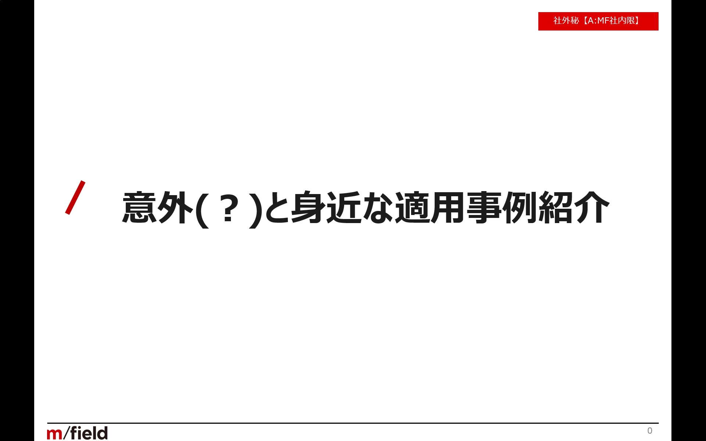

<br>

|   |   |
|---|---|
| 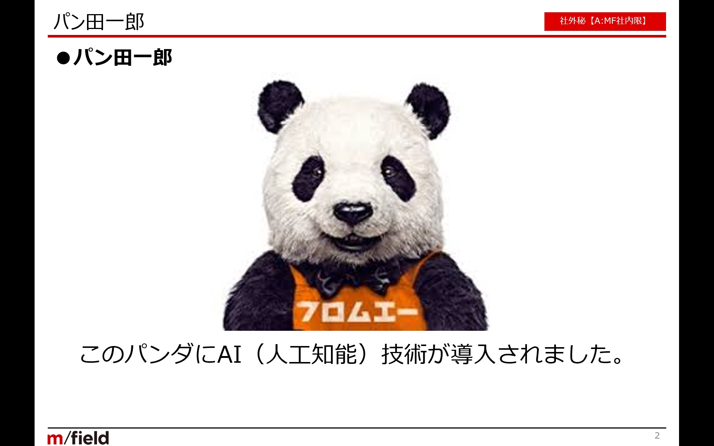 | 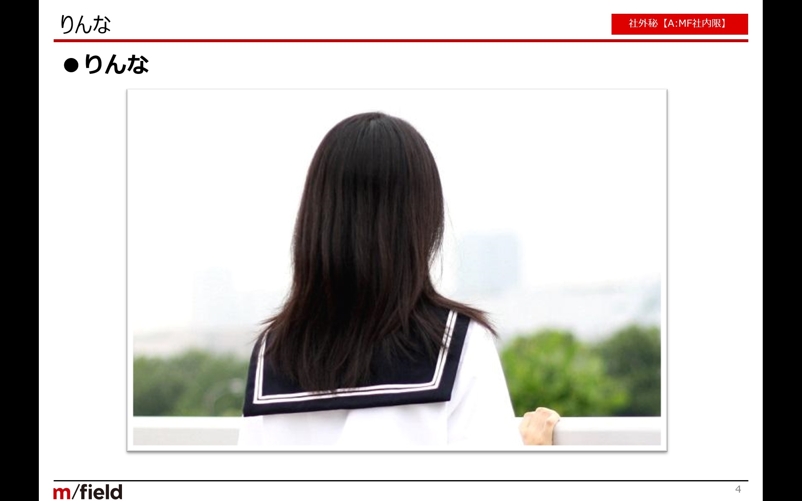 |

<br>

|   |   |
|---|---|
| 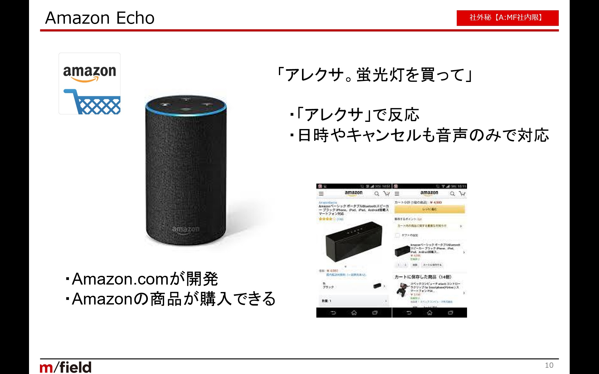 | 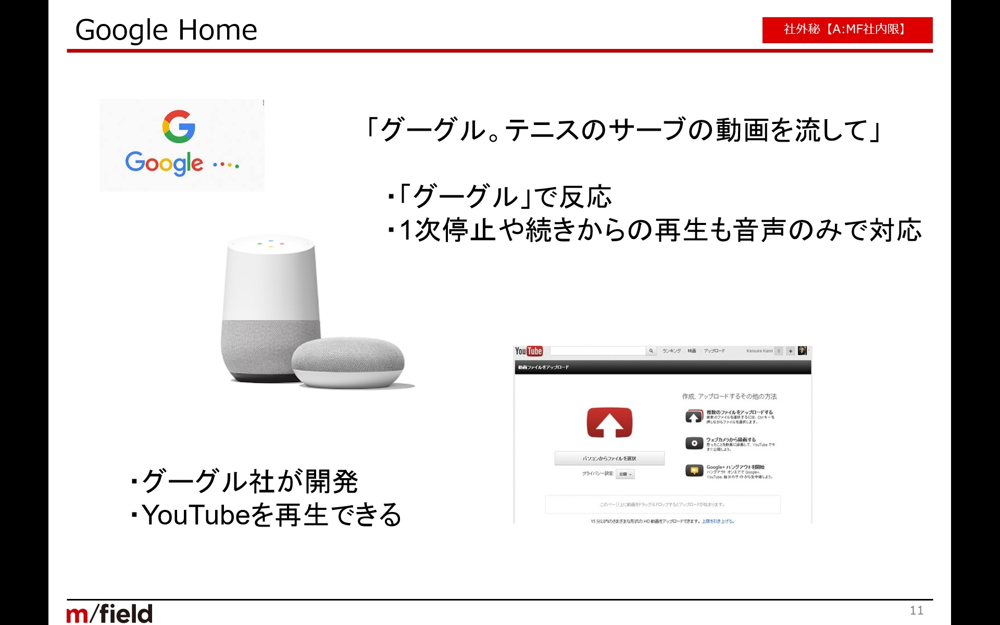 |

<br>
# <a name="1.2."></a>
### 1.2. ディープラーニング紹介
続いて、ディープラーニングの仕組みや、AIに言葉を覚えさせる（自然言語処理）までの工程を説明しました。
<br>

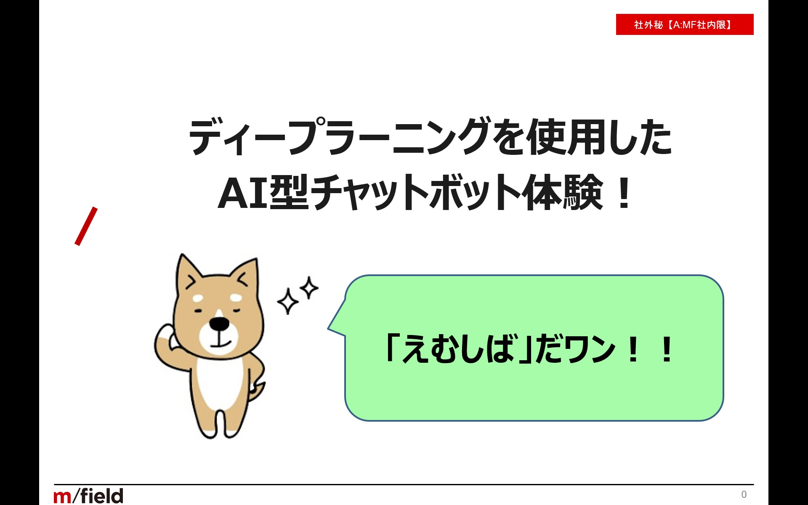

<br>

|   |   |
|---|---|
| 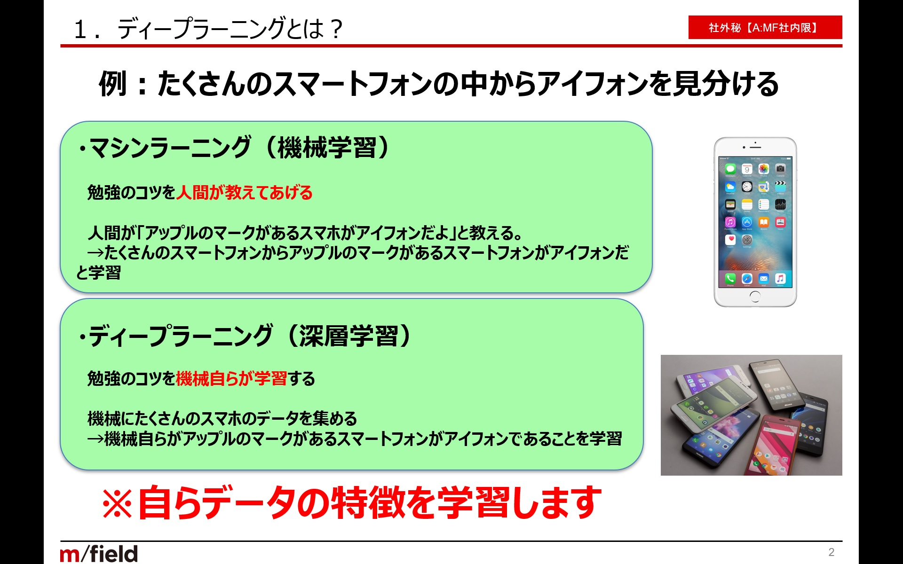 | 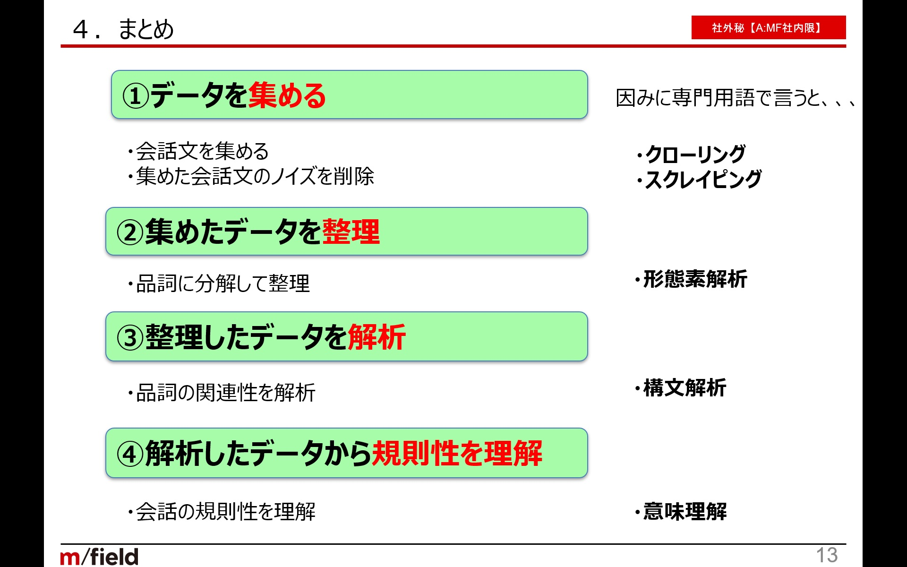 |

<br>
---
# <a name="2."></a>
## 2. 実際の処理に触れてみよう（ハンズオン）
環境は、Googleが提供する機械学習の教育、研究を目的とした研究用ツール**「[Google Colaboratory](https://colab.research.google.com/notebooks/welcome.ipynb)」**を使用しました。
<br>

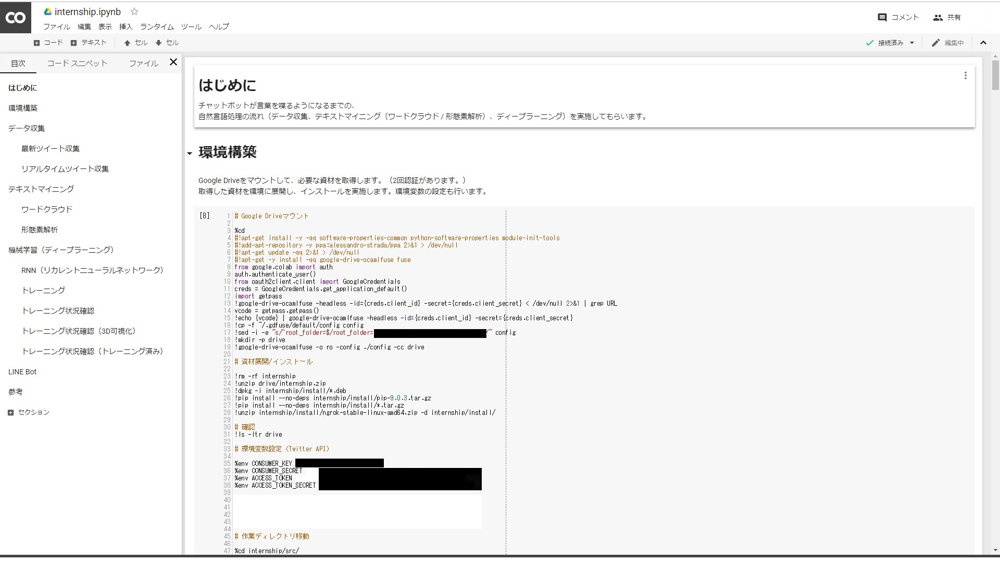

<br>

ハンズオンは以下の内容で実施しました。
<br>

==**ハンズオン実施内容**==
>1. データ収集
>2. テキストマイニング
>3. ディープラーニング

<br>
# <a name="2.1."></a>
### 2.1. データ収集
ディープラーニングで使用する「会話」データを、Twitterから収集しました。
<br>
学生さん達に、検索ワードを決めてもらい、そのワードに関連する「つぶやき」を、Twitter APIラッパーの**「[Tweepy](http://www.tweepy.org/)」**ライブラリを使用して、「ツイート」と「リプライ」を対にした「会話」データとして収集しました。
<br>

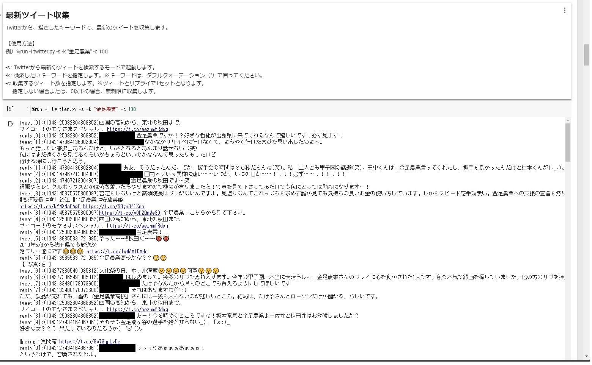

<br>
# <a name="2.2."></a>
### 2.2. テキストマイニング
学生さん達が「Twitter」から収集した「ツイート」、「リプライ」の会話から、ディープラーニングで使用する**「対訳コーパス<sup>[1](#note1)</sup>」**を作成する為に、テキストマイニングを行いました。
<br><br>
<sup><a name="note1">1</a></sup> 対訳コーパスは、「自然言語処理」における機械翻訳の学習データとして利用する為等に構築された、「文と文が対訳の形で纏めた」ものを指します。
<br>
# <a name="2.2.1."></a>
#### 2.2.1. ワードクラウド
**「[wordcloud](https://github.com/amueller/word_cloud)」**ライブラリを使用し、収集した「会話文」の中から、出現頻度が高い「単語」を調べ、文字と画像埋め込みの可視化を行いました。
<br>

|   |   |
|---|---|
| 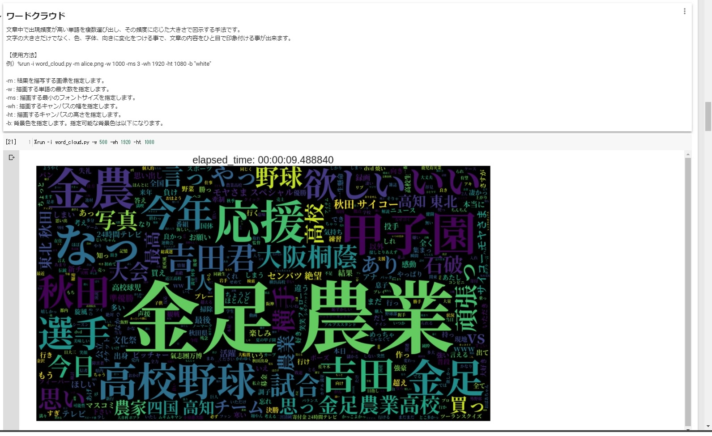 | 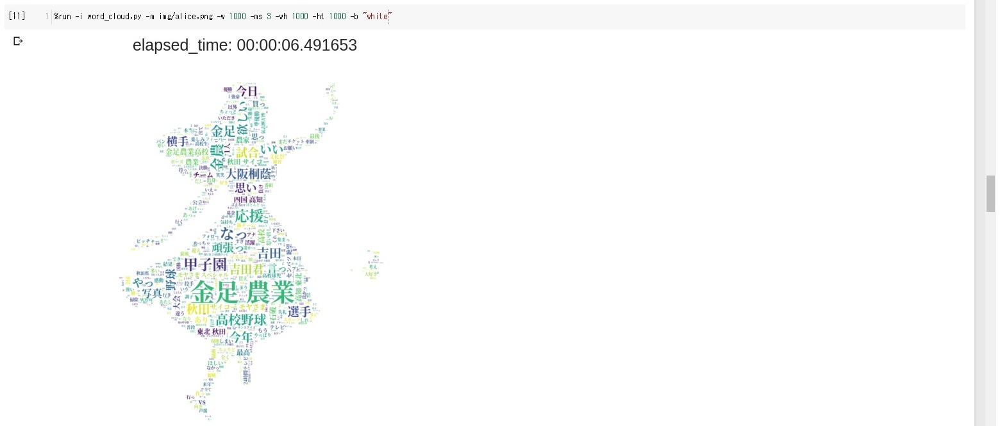 |

<br>
# <a name="2.2.2."></a>
#### 2.2.2. 形態素解析
形態素解析ライブラリ**「[MeCab](http://taku910.github.io/mecab/)」**、辞書**「[mecab-ipadic-NEologd](https://github.com/neologd/mecab-ipadic-neologd)」**を使用して、「対訳コーパス」を作成しました。
<br>

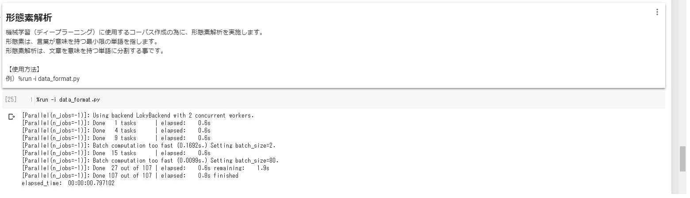

<br>
また形態素解析を行う際、データの「正規化」、「スクレイピング」、「ストップワード除去処理<sup>[1](#note2)</sup>」を実施しました。
<br>
コードを以下に記します。
<br>
```python
import MeCab
import unicodedata
import emoji
import re

# ストップワード取得
with open("Japanese.txt", "r", encoding="utf-8") as f :
    global stopwords
    stopwords  = [stopword.strip() for stopword in f.readlines()]

# クリーニング処理
def creaning(sentence, stopwordflg = False):
    # 絵文字除去
    sentence = "".join(c for c in sentence if c not in emoji.UNICODE_EMOJI)
    # 文字の正規化
    sentence = unicodedata.normalize("NFKC", sentence)
    # 改行、タブ、スペース除去
    sentence = sentence.replace("\n", "").replace("\r", "").replace("\t","").replace(" ", "")
    # ユーザ名除去
    sentence = re.sub(r"@([A-Za-z0-9_]+)", "", sentence)
    # URL除去
    sentence = re.sub(r"https?:\/\/.*", "", sentence)
    # ハッシュタグ除去
    sentence = re.sub(r"[#]([ー゛゜々ヾヽぁ-ヶ一-龠a-zA-Z0-9_]*[ー゛゜々ヾヽぁ-ヶ一-龠a-zA-Z]+[ー゛゜々ヾヽぁ-ヶ一-龠a-zA-Z0-9_]*)", "", sentence)

    # 入力データの場合
    if stopwordflg:
        # 句読点除去
        sentence = re.sub(r"[。、]+", "", sentence)
        # ストップワード除去
        return remove_stopwords(MeCab.Tagger(r"-Owakati -d ../install/mecab-ipadic-neologd").parse(sentence).strip().split())

    else:
        return MeCab.Tagger(r"-Owakati -d ../install/mecab-ipadic-neologd").parse(sentence).strip()

# ストップワード除去
def remove_stopwords(words):
    sentence = ""

    for word in words:
        if not word in stopwords:
            sentence += word + " "

    return sentence.strip()
```
<br>
<sup><a name="note2"></a>1</sup> [SlothLib](http://svn.sourceforge.jp/svnroot/slothlib/CSharp/Version1/SlothLib/NLP/Filter/StopWord/word/Japanese.txt)で定義されたデータをストップワードとしています。
<br>
# <a name="2.3."></a>
### 2.3. ディープラーニング
**「[TensorFlow](https://www.tensorflow.org/?hl=ja)」**ライブラリを使用して、**「[GRU](https://en.wikipedia.org/wiki/Gated_recurrent_unit)」**モデルでディープラーニングを実施しました。
<br>

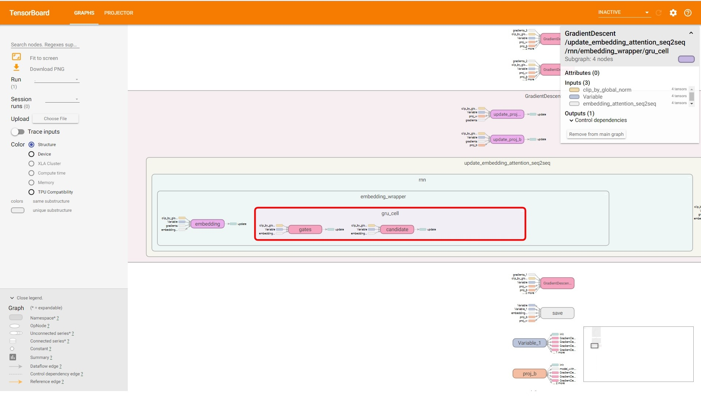

<br>
# <a name="2.3.1."></a>
#### 2.3.1. トレーニング
トレーニングを実施し、「対訳コーパス」から**「特徴量」**を算出しました。
<br>

|   |   |
|---|---|
| 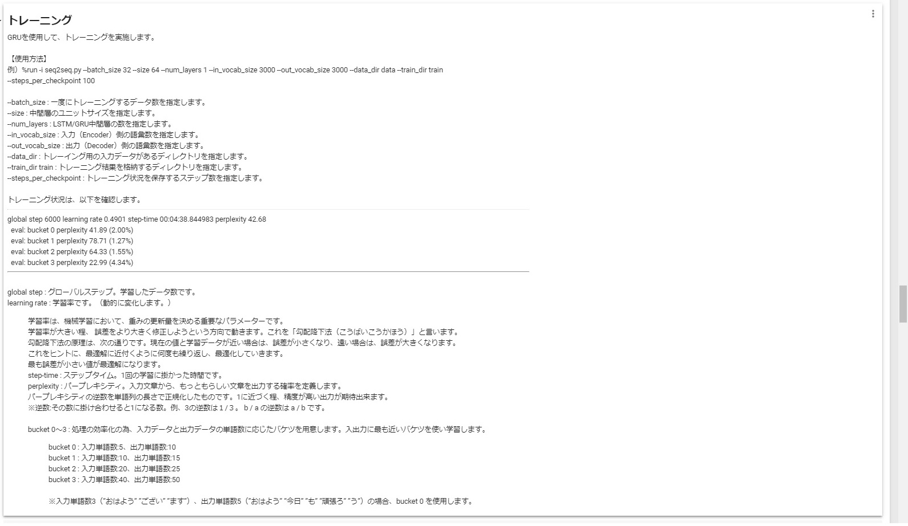 | 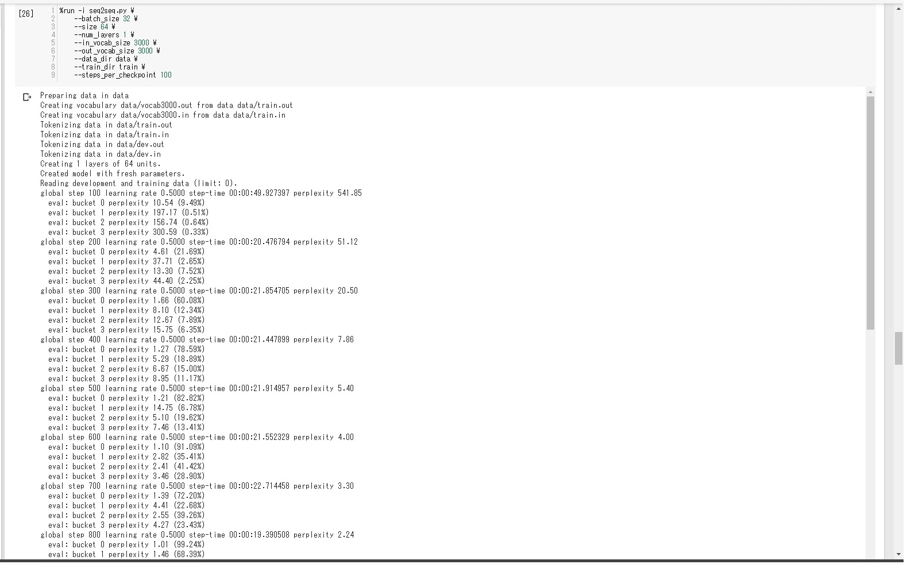 |

<br>
# <a name="2.3.2."></a>
#### 2.3.2. トレーニング状況確認
トレーニング状況を、対話形式（チャットボット）で確認してもらいました。
<br>
※データ数が少ないので、あまり「会話」が成立しません。
<br>

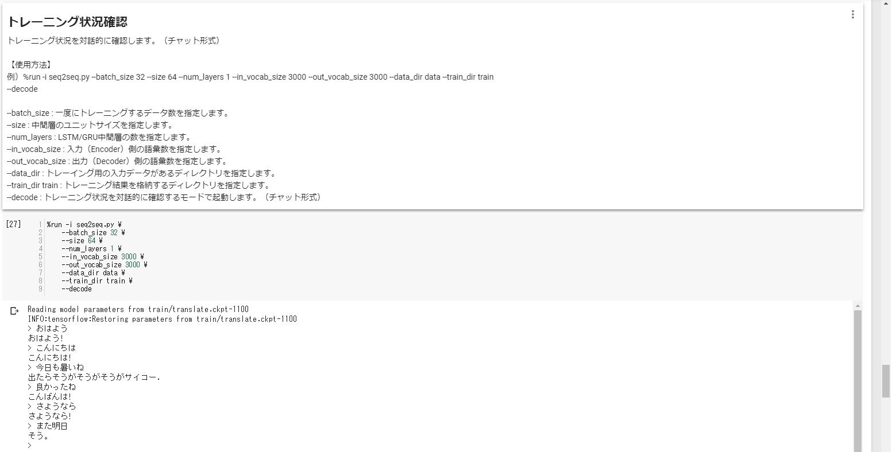

<br>
# <a name="2.3.3."></a>
#### 2.3.3. トレーニング状況確認（トレーニング済み）
次に、データ数、トレーニング時間による、「会話」精度の違いを確認してもらいました。
<br>
モデルは以下の設定で事前にトレーニングしました。
<br>

>対訳コーパス数: 2,000,000
<br>
>バッチサイズ: 64
<br>
>ユニットサイズ: 1024
<br>
>GRUモデル中間層数: 3
<br>
>語彙数: 120,000
<br>
>ステップ数: 300,000
<br>

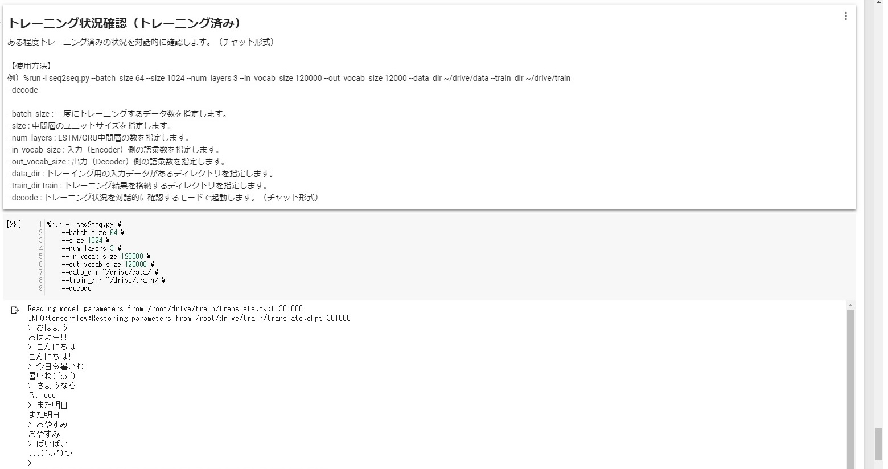

<br>
---
# <a name="3."></a>
## 3. LINEのチャットボットで遊んでみよう
ディープラーニングを使用したAIチャットボット、**「えむしばくん<sup>[1](#note3)</sup>」**をLINEの**「[Messaging API](https://developers.line.me/ja/services/messaging-api/)」**を使用し、チャットボット公開しました。
<br>
学生さん達にアクセスして、「会話」を楽しんでもらいました。
<br>

|   |   |
|---|---|
|  |  |

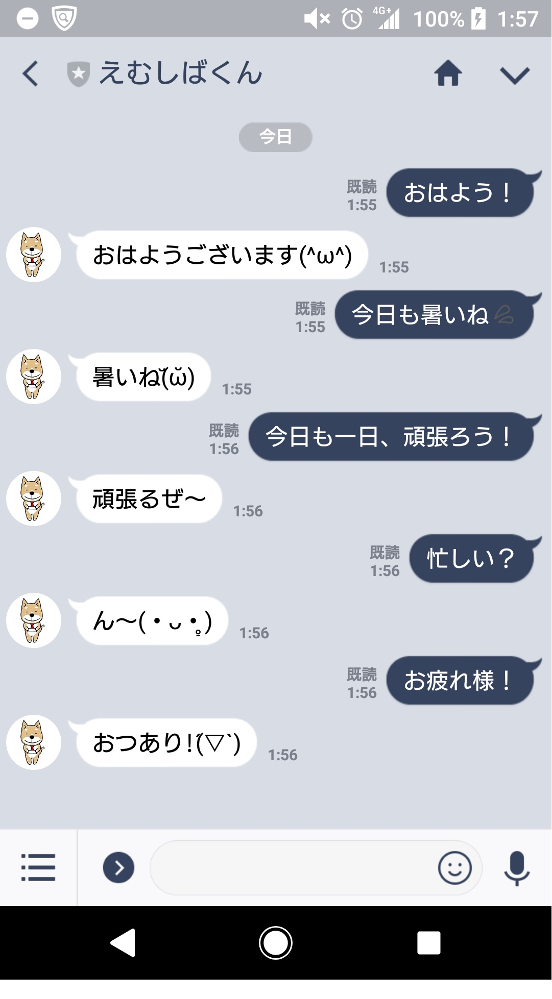

<br>
<sup><a name="note3">1</a></sup> 弊社のマスコットキャラクターです。[LINEスタンプ](https://store.line.me/stickershop/product/1829000/ja)販売しています。
<br>
# 最後に
今回のインターンシップは、ES事業部初の試みとなり、準備から開催までの期間が短く、課題も多く見つかりました。
<br>
冬のインターンシップに向けて、来ていただく学生さん達に楽しんでもらい、弊社に興味を持っていただけるように、内容をブラッシュアップし臨みたいと思います！