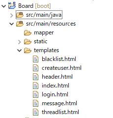

Title: サマーインターンシップ2018実施報告
 
Date: 2018-09-25 09:00
 
Category: report
 
# Java未経験による、はじめてのSpring Boot開発
2018年9月27日（木）に1Dayインターンシップとして、**『 ディープラーニングを使用したAIチャットボット体験！ 』**を開催しました。
 
5名の学生さんに参加してもらいました。ありがとうございました！
 
今回は、実施したインターンシップの内容を報告します。
 
# 目次
* [研修概要](#overview)
* [1. 自己紹介](#1.)
 * [1.1. 経歴](#1.1.)
* [2. 研修について](#2.)

 * [2.1. 研修内容](#2.1.)
 * [2.2. Spring](#2.2.)
     * [2.2.1. Webアプリケーションの概要](#2.2.1.)
     * [2.2.2. 使用したSpringのツールや機能](#2.2.2.)
 * [2.3. MyBatis](#2.3.)
     * [2.3.1. MyBatisとは](#2.3.1.)
     * [2.3.2. MyBatisの特徴](#2.3.2.)
     * [2.3.3. MyBatisの導入](#2.3.3.)
 * [2.4. セッション管理](#2.4.)
* [3. まとめ](#3.)

# 
## 研修概要
2018年8月に中途入社しました辻と申します
 

==**研修の流れ**==
>1. 
>2. 
>3. 

# 
## 1. 自己紹介
# 
### 1.1. 経歴
はじめに私の経歴を簡単にではありますが書かせていただきます。  
私は前職もm/fieldと同じITの会社に勤めていました。 
その会社ではプログラムのテストを行う仕事をしており、作成されたプログラムが正しく動くか確認したり、変更された画面がちゃんと表示されているかのチェックなどを行っていました。 
その仕事では全くプログラミングに触れる機会はなく、使っているツールもExcelとWordでした。 
そういった状況でせっかくIT業界にいるのにずっとテストばかりしても将来的に活かせるところは限られるだろうと考えるようになりました。 
そこからもっとプログラミングを使用した開発に携わりたい、将来的に活かせる技術を身につけたいと思い立ち前社を退職し、2018年8月にM-fieldに入社することとなりました。 
転職を決意してからいろいろな会社を探している中で、知り合いがm/fieldに在籍しており自分が転職するということを聞きm/fieldを紹介してくれました。 
そして紹介を受けてからm/fieldのことを知り合いに聞いたり自分で調べる中で、未経験者に対してのしっかりとした研修制度、在籍している方々の人柄の良さや会社の将来性などいろいろと知りm/fieldに転職する事を決意しました。 
特に前社でほぼプログラミングに触れていない自分が開発の現場で仕事ができるのかというところが何より不安に思っていたので、研修制度がしっかりしているところが入社の決め手になりました。 
次の項目から上記の通りほぼ未経験の自分がm/fieldに入社してから実際に行った研修の内容をご紹介していきます。

---
# 
## 2. 研修について
私がM-fieldに入社してから2か月間の研修を受け、最終的に研修の最終課題でJavaを使ったアプリケーションを作成しました。 
その作成までの研修内容と作成したアプリケーションについてご紹介します。
  

研修は以下の内容で実施しました。
 

==**研修実施内容**==
>1.XXXXX 
>2.XXXXX 
>3.XXXXX 
>4.XXXXX 
>5.XXXXX 
>6.XXXXX 

 
# 
### 2.1. 研修内容
XXXXX 
XXXXX 
XXXXX 
  

今回はSpring研修で学んだ内容を記します。
 
# 
### 2.2. Spring
# 
#### 2.2.1. Webアプリケーションの概要 
**「Springフレームワーク」**を使用して掲示板サイトを作成しました。 

以下作成した課題の概要です。  
▶掲示板サイトとしての主な機能 
>機能 
・ユーザーのログイン・ログアウト機能 
（ログインの時に一般ユーザーか管理者か判別する） 
・新規ユーザー登録 
・スレッド作成・削除 
・メッセージの投稿 
・ユーザーのブラックリスト登録・削除 

>非機能 
・セッション管理 

▶画面遷移図

  

▶データ定義（データベースの構成） 

>データベースのテーブルは全4テーブル 
①membersテーブル - 全ユーザーのデータ 
②blacklistテーブル - ブラックリストに登録されたユーザーのデータ 
③threadsテーブル - 全スレッドのデータ 
④messageデータ - 全メッセージ（投稿）のデータ  
 

# 
#### 2.2.2. 使用したSpringのツールや機能 

・STSを使用したプロジェクト作成 
今回はeclipseのSpringに特化した開発ツールである「Spring Tool Suite(STS)」を使用して作成しました。  
・STSでのプロジェクト作成 
まず新規にプロジェクトを作成します。 
新規→Springスターター・プロジェクト 
 

・Thymeleaf 
次に**「Thymeleaf[1](#note1)」**というテンプレートエンジンを使用するためにMavenのライブラリ管理ファイルである**「pom.xml」**の<dependencies\>タグ内に下記の記述を追加します。 

<a name="note1">1</a>
XML/XHTML/HTML5で書かれたテンプレートを変換して、アプリケーションのデータやテキストを表示することができる。Thymeleaf用のタグを使用することでWebサーバから受け取ったデータを埋め込んだり、事前定義された処理を追加して動的なページが作成できる。
 
  
そしてhtmlファイルを以下のように配置します。 
 

実装したコードは以下になります。
  

**<message.html>** 
  
>・上記コードの処理説明 
**th:each、th:textタグ**を使用することでJava側から渡された値をページに表示させることができる。（選択したスレッドのメッセージ、投稿者等を表示することができる）  

**<threadlist.html>** 
  
>・上記コードの処理説明 
**th:ifタグ**を使用することで管理者か否かを条件分岐としてth:ifタグ以下の部分(spanタグに囲まれた部分)の表示・非表示を切り替えられる。
  

・MVC
 
MVCはModel / View / Controllerを表しておりアプリケーションソフトウェアを実装するためのデザインパターンになります。 
それぞれ役割分担することで、アプリケーション開発を効率的に行うことができ、各プログラムの独立性が高くなることで仕様変更にも柔軟に対応できます。 
<MVCの役割> 
>**model**: アプリケーションのデータを扱う 
**view**: クライアントからの入力やクライアントへの出力を担う 
&emsp;&emsp;&emsp;(今回は上記項目のThymeleafがViewにあたります) 
**controller**: クライアントからの入力を受け取りmodelとviewへ指示する  

また、今回作成する上で上記以外に「service」と「repository」という役割のクラスを追加しています。
>**service**: ビジネスロジックを実行するためのメソッドを実装。 
**repository**: データベースを操作するためのメソッドを実装。 
&emsp;&emsp;&emsp;&emsp;&emsp;(今回は下記項目のMyBatisがrepositoryにあたります) 

図で表すとこのようになります。
 

# 
### 2.3. MyBatis
# 
#### 2.3.1. MyBatisとは 
**「[MyBatis](http://www.mybatis.org/mybatis-3/ja/)[1](#note2)」**を使用して、データベースアクセスの機能を実装しました。
  
※要変更
<a name="note2">1</a> 「O/Rマッパー」と呼ばれるツールの１つ。機能としてJavaのオブジェクトとデータベース操作言語のSQLの関連付けができる。 
そうすることでJavaの処理を実行するとそれに対応するSQLが実行できるようになる。
  
# 
#### 2.3.2. MyBatisの特徴 
MyBatisは他のO/Rマッピングフレームワーク(JPA)とは異なりデータベースとオブジェクトをマッピングするのではなく、
SQL文とオブジェクトのマッピングを行う。
そのため、SQLのJoin、複雑なSQLが柔軟に実装でき、Entiyの制約を受ける事なく、
少ない労力で実装ができる。 
また、下記に示したように、SQL内にタグを記載することによって、
動的なSQLを実装する事が可能となる。

・MyBatisの特徴的な機能 
①動的SQL 
SQL文に条件分岐や繰り返し処理など追加することでより複雑なSQL文を実行することが可能。 
使用できるタグは以下になります。（一部）
><if\> 
条件分岐を追加する。検索条件を追加したりするときに使用。 
><choose\> 
上記の単純な条件分岐ではなくケースごとに処理を使い分けたいときに使用。 
><trim\> 
上記の条件分岐で複数の条件を指定してどれにも当てはまらない場合、WHERE句に条件が入らないなどで構文エラーが起こらないようにtriｍを使用する。
><foreach\> 
リスト等の複数の値をIN句等と組み合わせて検索をする場合に使用する。

②resultMap 
SQLの実行結果を任意の項目にMappingする事が可能 
オブジェクト同士の名称を一致させる事なく、マッピングする事が可能となり、
SQLに合わせた、DTOを都度作成する必要がなくなる。
 
  
# 
#### 2.3.3. MyBatisの導入
今回その機能を実際に使用するまでの流れと実際の処理内容をご紹介します。

まずSpringBootの設定ファイルである**「application.properties」**ファイルにDataBaseアクセスのための情報を記述します。(MySQLを使用する場合)

  

次にMyBatisを使用するためにMavenのライブラリ管理ファイルである**「pom.xml」**の<dependencies\>タグ内に下記の記述を追加します。 
(versionは環境によって異なる場合があります)

  
これで接続のための準備は完了したので次は実際の処理を作成していきます。
  
MyBatisの処理を実装するために下記のクラス、ファイルを作成 
①SQL処理を呼び出すMapperインターフェースクラス 
②SQL文を記述するXMLファイル  
2つのファイルを以下のようにMapperフォルダ内に配置します。 

掲示板サイトに実装したコードは以下になります。
  

**<UserMapper.java>** 
  
**<UserMapper.xml>** 
 
>・上記コードの処理説明 
「UserMapper.xml」のselect文内の**ifタグ(if testの部分)**を使用することで動的SQLが可能になり、 
パスワードの値(pass)が入っていれば検索条件を追加が可能。   

**<MessageMapper.java>** 
  
**<MessageMapper.xml>** 
 
>・上記コードの処理説明 
「MessageMapper.xml」のselect文内の**foreachタグ**を使用することでList型の値をに入っている値を条件として使用することができる。
  

# 
### 2.4. セッション管理
非機能としてセッション管理を実装しました。 
ログインを行っていないユーザー（セッションIDを取得していないユーザー）がログイン画面以外にアクセスした場合、強制的にログイン画面に遷移します。 
またこの処理を実装するにあたり「AOP(アスペクト指向プログラミング)[1](#note3)」を使用しました。  
<a name="note3">1</a>
「本来のプログラムの処理（掲示板の機能）」とは別に「動きを記録するロギング操作」などの共通処理をモジュール化し分離することで、把握・管理・変更を容易にする。 
そしてモジュール化した操作をメソッドの前後で任意に実行させることができる。
  
掲示板サイトに実装したコードは以下になります。 
**<LoginInterceptor.java>** 
  
**<LoginInterceptorConfig.java>** 
 
>・上記コードの処理説明 
「LoginInterceptor.java」でクラス名を「preHandle」とすることでcontrollerメソッドの実行前に共通処理を実行することができる。セッションを取得していない場合ログイン画面に遷移する処理を記述。 
「LoginInterceptorConfig.java」では処理する対象と除外する対象を設定している。
  

---

# 
## 3. まとめ
研修ではまず最初にそれぞれのスキルレベルや経験に合わせてカリキュラムが組まれるのが良かったです。 
そして上長が進み具合や理解度などを逐一確認していただいたおかげで2か月間の研修を終えることができました。 
研修の中では日々新しいことを勉強する中で理解が追い付かずついあいまいなまま進もうとしして余計に袋小路に入ってしまい大きく時間を取られてしまう状況がありました。 
その時に上長から「スケジュール通りに進めるのではなく、本当に理解して進めているかが重要だ」と言われ、きちんと目の前のことを理解してから進むことがなにより重要だと気づかされました。 
またわからないところを質問しに行った時もしっかりと時間を取ってくださり細かいところまでちゃんと理解できるところまで説明してもらうなど研修中は常に気を使ってくださりました。 
そうして今回2か月間の研修を行い、ほぼ未経験の自分がプログラミングの技術を身につけて最終的にWebアプリケーションを作成できるようになりました。 
今後はここからもっとプログラムや設計について学び、開発現場で活かして行きたいと思います。

# 最後に
この記事を見て、m/fieldに興味を持った方はm/field採用までご連絡下さい。未経験採用行っております。
